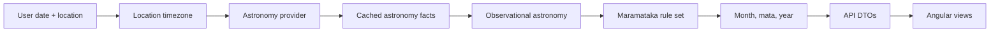

# Architecture

The app is an astronomy-backed Matariki calendar. It calculates maramataka
months, mata, year rhythm, and timeline events for a selected date and
location. The active source model is the Living by the Stars 2021-2024 calendar
material.

## Calculation Flow

## Layers

### Location

Location supplies latitude, longitude, and timezone. Local dates are interpreted
in the selected timezone before asking the astronomy and maramataka layers for
events.

### Raw Astronomy

The raw astronomy layer provides stable astronomical facts:

- moon phases
- New Moons and Full Moons
- moonrise, moonset, transit, and illumination details
- dawn sky and sunrise horizon limits

These values are cached with a raw astronomy fingerprint namespace.

### Observational Astronomy

The observational layer turns raw sky positions into dawn-facing observations:

- configured star and planet marker positions
- first dawn appearances
- Matariki night-invisibility periods
- dawn field-of-view filtering

These values are cached with an observational astronomy fingerprint namespace.

### Maramataka Rules

The maramataka domain applies a named rule set to astronomy results. The current
default rule set is `living-by-the-stars-observational-v1`, exposed through the
rule-set registry. Rule sets define:

- mata names and phase groups
- Whiro and mata boundary interpretation
- year-start logic
- Ruhanui placement logic
- named star-month markers
- Matariki holiday marker logic

Generated month and year results use the maramataka rule-set fingerprint for
in-memory cache keys. They are not persisted to disk today.

### API

The Nest API resolves request date/location parameters, calls the maramataka
service, and returns JSON DTOs for the frontend. Startup logs include active
cache fingerprints and compact metadata summaries under the `CacheFingerprint`
logger.

Month, cycle, and year responses include an API-safe rule-set summary with the
source id/version, `mataVersion`, metadata schema version, and rule-set
fingerprint used for the calculation.

### Frontend

The Angular app presents the same calculated data in focused views:

- selected day and dawn sky
- month wheel and mata list
- year timeline
- diagnostic/source context where useful

UI views should not duplicate calendar rules. They should render the rule-set
and astronomy data returned by the API.

The maramataka page uses a page-scoped data store/facade for frontend loading
orchestration. That store owns selected date/location state, request
cancellation, shared page data, year core loading, and timeline enrichment. The
page component stays mostly responsible for user interactions and passes signal
state into child views.

## Extension Points

- Add a new calendar by registering another `MaramatakaRuleSet`.
- Add new event layers by keeping calculated astronomy, rule interpretation,
  and UI presentation models separate.
- Add persistent generated year/month caches only if generation cost becomes a
  production issue.
- Add user-facing rule-set selection after there is more than one reviewed
  calendar model ready for use.
